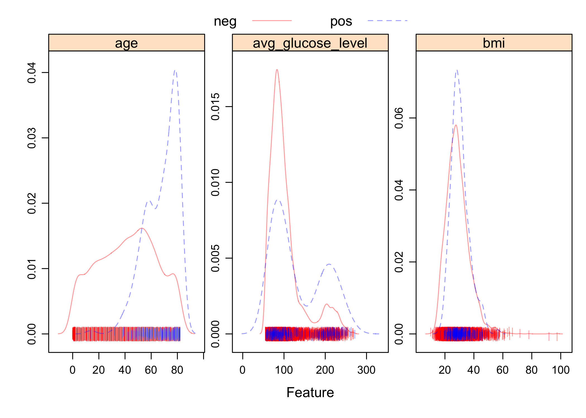

P8106 Midterm Project
================
Lin Yang

``` r
library(tidyverse)
library(caret)
library(pROC)
library(AppliedPredictiveModeling)
```

## Partition the dataset into training data and test data

``` r
stroke_dat <- read.csv("healthcare-dataset-stroke-data.csv") %>% 
  janitor::clean_names() %>% 
  select(-1) %>% #delete the id column
  filter(bmi != 'N/A') %>% 
  mutate(bmi = as.numeric(bmi), #remove missing bmi values
         stroke = as.factor(stroke))

set.seed(2022)
trainRows <- createDataPartition(y = stroke_dat$stroke, p = 0.8, list = FALSE)
stroke_train <- stroke_dat[trainRows, ]
stroke_test <- stroke_dat[-trainRows, ]

x_train <- model.matrix(stroke ~ ., stroke_train)[ , -1]
y_train <- stroke_train$stroke

x_test <- model.matrix(stroke ~ ., stroke_test)[ , -1]
y_test <- stroke_test$stroke
```

## EDA

``` r
summary(stroke_dat)
```

    ##     gender               age         hypertension     heart_disease   
    ##  Length:4909        Min.   : 0.08   Min.   :0.00000   Min.   :0.0000  
    ##  Class :character   1st Qu.:25.00   1st Qu.:0.00000   1st Qu.:0.0000  
    ##  Mode  :character   Median :44.00   Median :0.00000   Median :0.0000  
    ##                     Mean   :42.87   Mean   :0.09187   Mean   :0.0495  
    ##                     3rd Qu.:60.00   3rd Qu.:0.00000   3rd Qu.:0.0000  
    ##                     Max.   :82.00   Max.   :1.00000   Max.   :1.0000  
    ##  ever_married        work_type         residence_type     avg_glucose_level
    ##  Length:4909        Length:4909        Length:4909        Min.   : 55.12   
    ##  Class :character   Class :character   Class :character   1st Qu.: 77.07   
    ##  Mode  :character   Mode  :character   Mode  :character   Median : 91.68   
    ##                                                           Mean   :105.31   
    ##                                                           3rd Qu.:113.57   
    ##                                                           Max.   :271.74   
    ##       bmi        smoking_status     stroke  
    ##  Min.   :10.30   Length:4909        0:4700  
    ##  1st Qu.:23.50   Class :character   1: 209  
    ##  Median :28.10   Mode  :character           
    ##  Mean   :28.89                              
    ##  3rd Qu.:33.10                              
    ##  Max.   :97.60

``` r
stroke_dat_con <- stroke_dat %>% select(age, avg_glucose_level, bmi)
theme1 <- transparentTheme(trans = .4)
trellis.par.set(theme1)

featurePlot(x = stroke_dat_con, 
            y = stroke_dat$stroke,
            scales = list(x = list(relation = "free"), 
                          y = list(relation = "free")),
            plot = "density", pch = "|", 
            auto.key = list(columns = 2))
```

<!-- -->

``` r
#correlation plot of predictors
corrplot::corrplot(cor(x_train), 
         method = "circle", 
         type = "full",
         tl.cex = 0.5)
```

<!-- -->

From the correlation plot, we can see that there are no highly
correlated predictors in general. `ever_marriedYes` is positively
correlated with `age`, which is reasonable.

## Fitting models

``` r
#glm
fit.glm <- glm(stroke ~ .,
               data = stroke_dat,
               subset = trainRows,
               family = binomial(link = "logit"))

test.pred.prob <- predict(fit.glm,
                     newdata = stroke_test,
                     type = "response")
test.pred <- rep("0", length(test.pred.prob))
test.pred[test.pred.prob > 0.5] <- "1"

confusionMatrix(data = as.factor(test.pred),
                reference = stroke_test$stroke,
                positive = "1")
```

    ## Confusion Matrix and Statistics
    ## 
    ##           Reference
    ## Prediction   0   1
    ##          0 940  41
    ##          1   0   0
    ##                                           
    ##                Accuracy : 0.9582          
    ##                  95% CI : (0.9437, 0.9698)
    ##     No Information Rate : 0.9582          
    ##     P-Value [Acc > NIR] : 0.5414          
    ##                                           
    ##                   Kappa : 0               
    ##                                           
    ##  Mcnemar's Test P-Value : 4.185e-10       
    ##                                           
    ##             Sensitivity : 0.00000         
    ##             Specificity : 1.00000         
    ##          Pos Pred Value :     NaN         
    ##          Neg Pred Value : 0.95821         
    ##              Prevalence : 0.04179         
    ##          Detection Rate : 0.00000         
    ##    Detection Prevalence : 0.00000         
    ##       Balanced Accuracy : 0.50000         
    ##                                           
    ##        'Positive' Class : 1               
    ## 

``` r
#ROC curve
roc.glm <- roc(stroke_test$stroke, test.pred.prob)
plot(roc.glm, legacy.axes = TRUE, print.auc = TRUE)
plot(smooth(roc.glm), col = 4, add = TRUE)
```

<!-- -->
