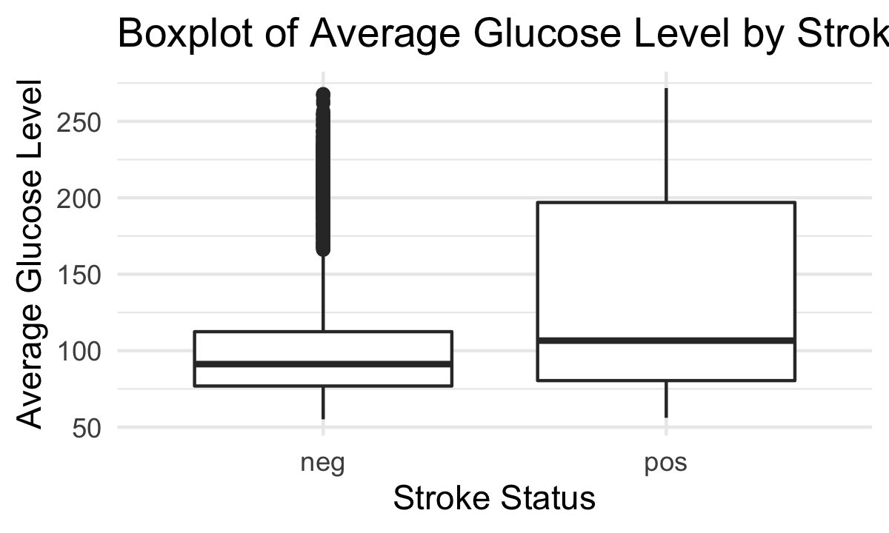
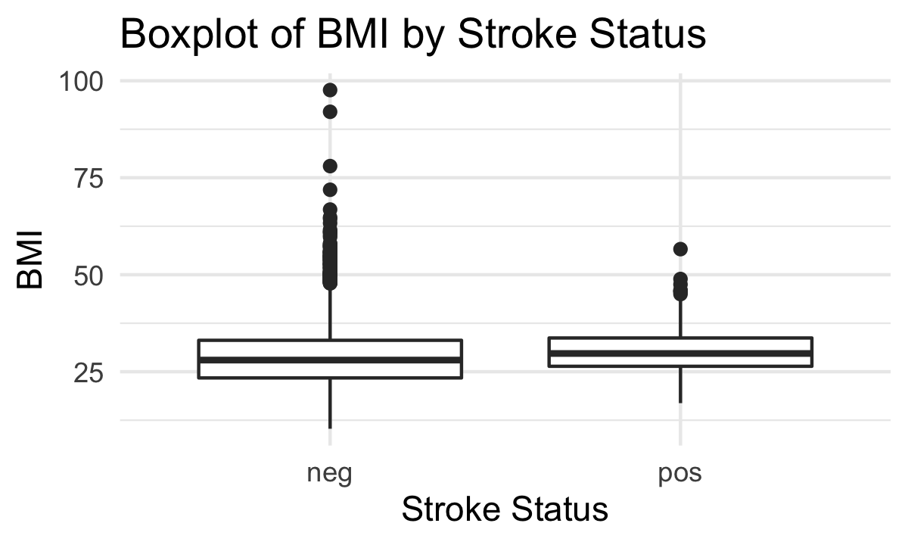
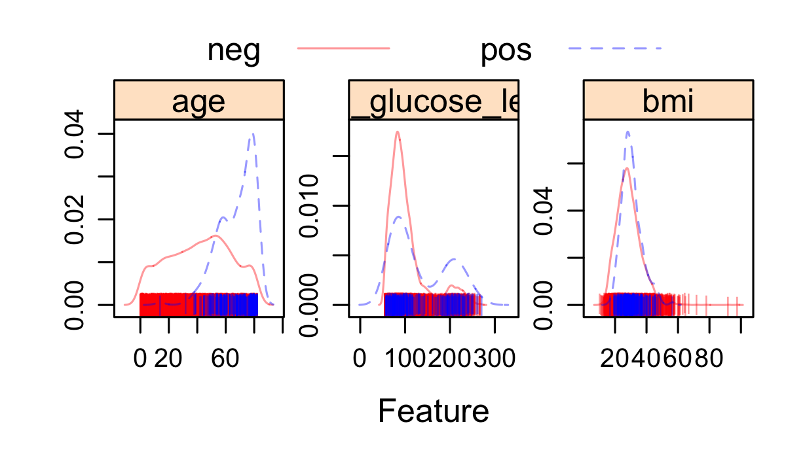
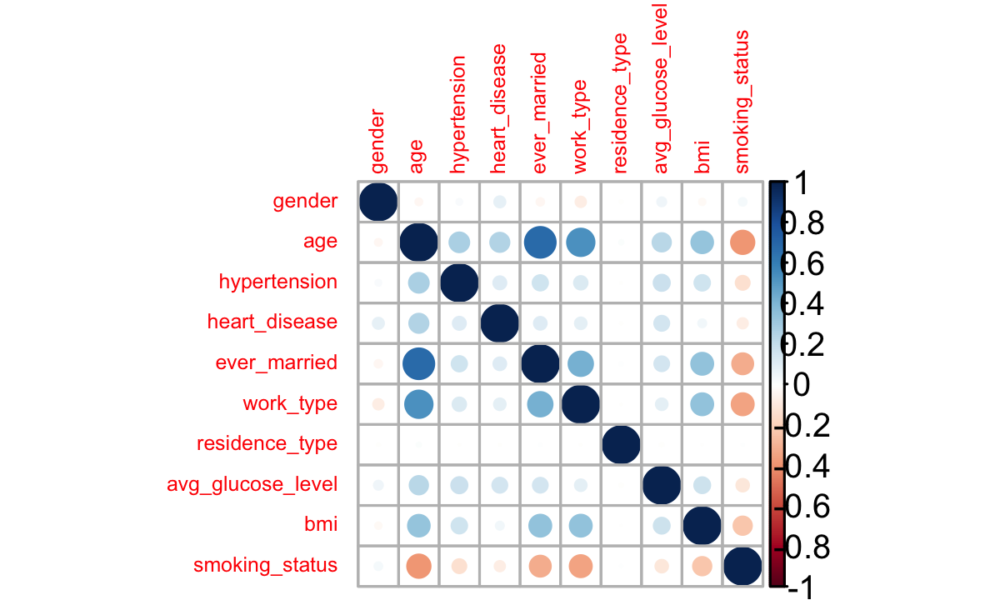
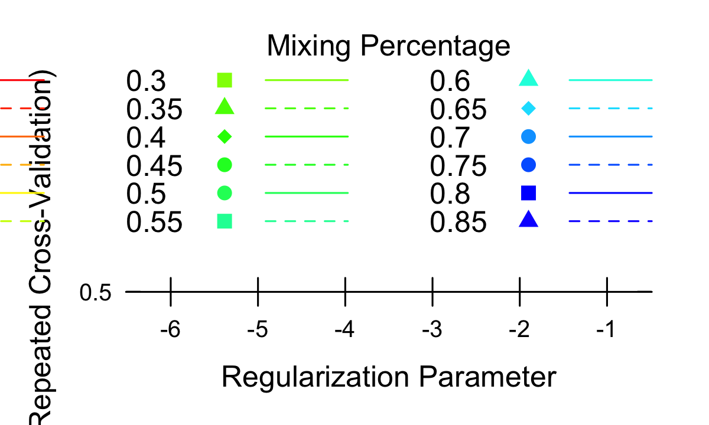
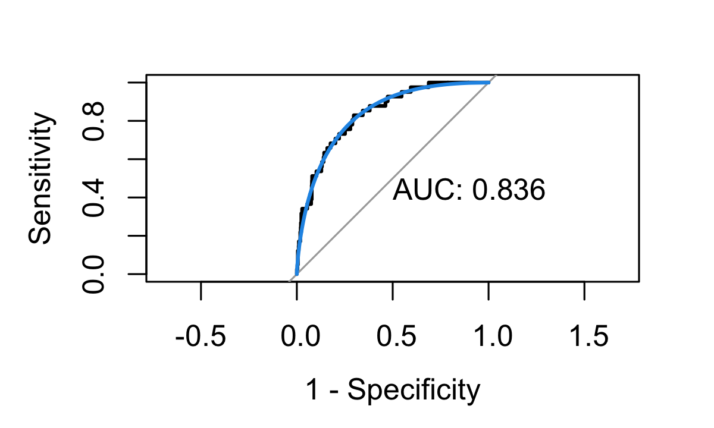
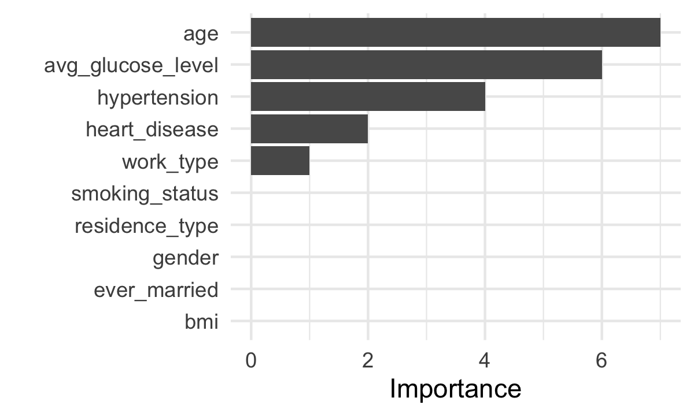
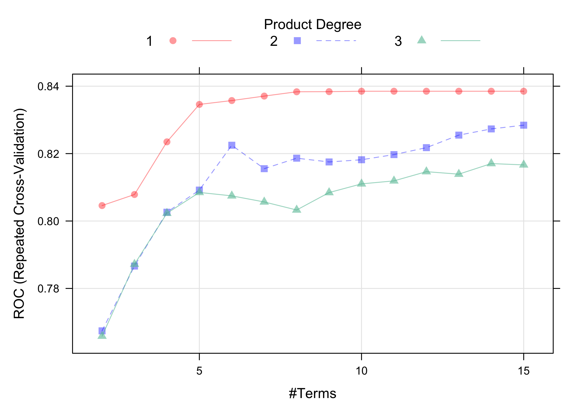
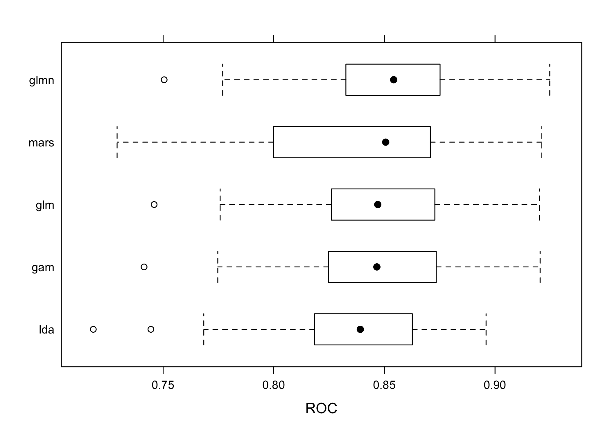
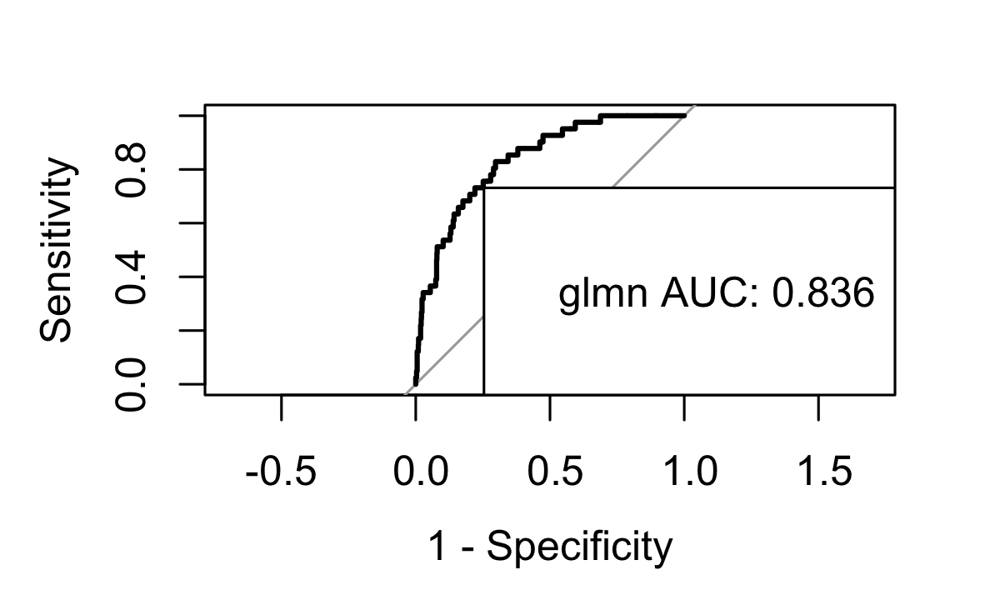

P8106 Midterm Project
================
Lin Yang

## Data cleaning

``` r
stroke_dat <- read.csv("healthcare-dataset-stroke-data.csv") %>% 
  janitor::clean_names() %>% 
  dplyr::select(-1) %>% #delete the id column
  filter(bmi != "N/A") %>% 
  filter(gender != "Other") %>% 
  mutate(bmi = as.numeric(bmi),
         gender = as.numeric(factor(gender)) - 1,
         ever_married = as.numeric(factor(ever_married)) - 1,
         work_type = as.numeric(factor(work_type)) - 1,
         residence_type = as.numeric(factor(residence_type)) - 1,
         smoking_status = as.numeric(factor(smoking_status)) - 1,
         stroke = factor(stroke,
                         levels = c("0", "1"),
                         labels = c("neg", "pos")))

set.seed(1)
trainRows <- createDataPartition(y = stroke_dat$stroke, p = 0.8, list = FALSE)
stroke_train <- stroke_dat[trainRows, ]
stroke_test <- stroke_dat[-trainRows, ]

x_train <- stroke_train[ , -11]
y_train <- stroke_train$stroke

x_test <- stroke_test[ , -11]
y_test <- stroke_test$stroke
```

## EDA

``` r
#prevalence of stroke
stroke_dat %>%
  group_by(stroke) %>% 
  summarize(count = n()) %>% 
  mutate(proportion = round(count / sum(count), 3)) %>% 
  knitr::kable()
```

| stroke | count | proportion |
|:-------|------:|-----------:|
| neg    |  4699 |      0.957 |
| pos    |   209 |      0.043 |

``` r
stroke_dat %>%
  group_by(gender) %>% 
  summarize(count = n()) %>% 
  mutate(gender = recode(gender, `0` = "female", `1` = "male")) %>% 
  knitr::kable()
```

| gender | count |
|:-------|------:|
| female |  2897 |
| male   |  2011 |

``` r
stroke_dat %>%
  group_by(hypertension) %>% 
  summarize(count = n()) %>%
  mutate(hypertension = recode(hypertension, `0` = "no", `1` = "yes")) %>%
  knitr::kable()
```

| hypertension | count |
|:-------------|------:|
| no           |  4457 |
| yes          |   451 |

``` r
stroke_dat %>%
  group_by(heart_disease) %>% 
  summarize(count = n()) %>%
  mutate(heart_disease = recode(heart_disease, `0` = "no", `1` = "yes")) %>%
  knitr::kable()
```

| heart\_disease | count |
|:---------------|------:|
| no             |  4665 |
| yes            |   243 |

``` r
stroke_dat %>%
  group_by(ever_married) %>% 
  summarize(count = n()) %>%
  mutate(ever_married = recode(ever_married, `0` = "no", `1` = "yes")) %>%
  knitr::kable()
```

| ever\_married | count |
|:--------------|------:|
| no            |  1704 |
| yes           |  3204 |

``` r
#boxplots of continuous variables
ggplot(data = stroke_dat, aes(x = stroke, y = age), group = stroke) +
  geom_boxplot() +
  labs(title = "Boxplot of Age by Stroke Status",
       x = "Stroke Status",
       y = "Age")
```


``` r
ggplot(data = stroke_dat, aes(x = stroke, y = avg_glucose_level), group = stroke) +
  geom_boxplot() +
  labs(title = "Boxplot of Average Glucose Level by Stroke Status",
       x = "Stroke Status",
       y = "Average Glucose Level")
```



``` r
ggplot(data = stroke_dat, aes(x = stroke, y = bmi), group = stroke) +
  geom_boxplot() +
  labs(title = "Boxplot of BMI by Stroke Status",
       x = "Stroke Status",
       y = "BMI")
```



``` r
#density plots of stroke vs continuous variables
stroke_dat_con <- stroke_dat %>% dplyr::select(age, avg_glucose_level, bmi)
theme1 <- transparentTheme(trans = .4)
trellis.par.set(theme1)

featurePlot(x = stroke_dat_con, 
            y = stroke_dat$stroke,
            scales = list(x = list(relation = "free"), 
                          y = list(relation = "free")),
            plot = "density", pch = "|", 
            auto.key = list(columns = 2))
```



``` r
#correlation plot of predictors
corrplot::corrplot(cor(stroke_dat[1:10]), 
         method = "circle", 
         type = "full",
         tl.cex = 0.5)
```



## Fitting models

### Logistic regression

``` r
#glm
fit.glm <- glm(stroke ~ .,
               data = stroke_train,
               family = binomial(link = "logit"))

glm.pred.prob <- predict(fit.glm,
                     newdata = stroke_test,
                     type = "response")
glm.pred <- rep("neg", length(glm.pred.prob))
glm.pred[glm.pred.prob > 0.5] <- "pos"

confusionMatrix(data = factor(glm.pred),
                reference = stroke_test$stroke,
                positive = "pos")
```

    ## Confusion Matrix and Statistics
    ## 
    ##           Reference
    ## Prediction neg pos
    ##        neg 939  41
    ##        pos   0   0
    ##                                           
    ##                Accuracy : 0.9582          
    ##                  95% CI : (0.9437, 0.9698)
    ##     No Information Rate : 0.9582          
    ##     P-Value [Acc > NIR] : 0.5414          
    ##                                           
    ##                   Kappa : 0               
    ##                                           
    ##  Mcnemar's Test P-Value : 4.185e-10       
    ##                                           
    ##             Sensitivity : 0.00000         
    ##             Specificity : 1.00000         
    ##          Pos Pred Value :     NaN         
    ##          Neg Pred Value : 0.95816         
    ##              Prevalence : 0.04184         
    ##          Detection Rate : 0.00000         
    ##    Detection Prevalence : 0.00000         
    ##       Balanced Accuracy : 0.50000         
    ##                                           
    ##        'Positive' Class : pos             
    ## 

``` r
#ROC curve
roc.glm <- roc(stroke_test$stroke, glm.pred.prob)
plot(roc.glm, legacy.axes = TRUE, print.auc = TRUE)
plot(smooth(roc.glm), col = 4, add = TRUE)
```


``` r
#fit a logistic regression model using caret for CV
ctrl <- trainControl(method = "repeatedcv", repeats = 5,
                     summaryFunction = twoClassSummary,
                     classProbs = TRUE)
set.seed(1)
model.glm <- train(x = stroke_train[ , 1:10],
                   y = stroke_train$stroke,
                   method = "glm",
                   metric = "ROC",
                   trControl = ctrl)
```

### Penalized logistic regression

``` r
glmnGrid <- expand.grid(.alpha = seq(0, 1, length = 21),
                        .lambda = exp(seq(-6, -1, length = 30)))
set.seed(1)
model.glmn <- train(x = stroke_train[ , 1:10],
                    y = stroke_train$stroke,
                    method = "glmnet",
                    tuneGrid = glmnGrid,
                    metric = "ROC",
                    trControl = ctrl)

model.glmn$bestTune
```

    ##     alpha      lambda
    ## 277  0.45 0.006974342

``` r
myCol <- rainbow(25)
myPar <- list(superpose.symbol = list(col = myCol),
              superpose.line = list(col = myCol))
plot(model.glmn, par.settings = myPar, xTrans = function(x) log(x))
```



``` r
glmn.pred.prob <- predict(model.glmn,
                     newdata = stroke_test,
                     type = "prob")
glmn.pred <- ifelse(glmn.pred.prob$pos > 0.5, "pos", "neg")
confusionMatrix(data = as.factor(glmn.pred),
                reference = stroke_test$stroke,
                positive = "pos")
```

    ## Confusion Matrix and Statistics
    ## 
    ##           Reference
    ## Prediction neg pos
    ##        neg 939  41
    ##        pos   0   0
    ##                                           
    ##                Accuracy : 0.9582          
    ##                  95% CI : (0.9437, 0.9698)
    ##     No Information Rate : 0.9582          
    ##     P-Value [Acc > NIR] : 0.5414          
    ##                                           
    ##                   Kappa : 0               
    ##                                           
    ##  Mcnemar's Test P-Value : 4.185e-10       
    ##                                           
    ##             Sensitivity : 0.00000         
    ##             Specificity : 1.00000         
    ##          Pos Pred Value :     NaN         
    ##          Neg Pred Value : 0.95816         
    ##              Prevalence : 0.04184         
    ##          Detection Rate : 0.00000         
    ##    Detection Prevalence : 0.00000         
    ##       Balanced Accuracy : 0.50000         
    ##                                           
    ##        'Positive' Class : pos             
    ## 

``` r
#ROC curve
roc.glmn <- roc(stroke_test$stroke, glmn.pred.prob[ , 2])
plot(roc.glmn, legacy.axes = TRUE, print.auc = TRUE)
plot(smooth(roc.glmn), col = 4, add = TRUE)
```



### LDA

``` r
par(mar = c(1,1,1,1))
fit.lda <- lda(stroke ~ ., data = stroke_train)
plot(fit.lda)
```


``` r
lda.pred.prob <- predict(fit.lda, newdata = stroke_test, type = "prob")
posterior <- as.data.frame(lda.pred.prob$posterior)
lda.pred <- ifelse(posterior$pos > 0.5, "pos", "neg")

confusionMatrix(data = as.factor(lda.pred),
                reference = stroke_test$stroke,
                positive = "pos")
```

    ## Confusion Matrix and Statistics
    ## 
    ##           Reference
    ## Prediction neg pos
    ##        neg 932  38
    ##        pos   7   3
    ##                                          
    ##                Accuracy : 0.9541         
    ##                  95% CI : (0.939, 0.9663)
    ##     No Information Rate : 0.9582         
    ##     P-Value [Acc > NIR] : 0.7673         
    ##                                          
    ##                   Kappa : 0.1029         
    ##                                          
    ##  Mcnemar's Test P-Value : 7.744e-06      
    ##                                          
    ##             Sensitivity : 0.073171       
    ##             Specificity : 0.992545       
    ##          Pos Pred Value : 0.300000       
    ##          Neg Pred Value : 0.960825       
    ##              Prevalence : 0.041837       
    ##          Detection Rate : 0.003061       
    ##    Detection Prevalence : 0.010204       
    ##       Balanced Accuracy : 0.532858       
    ##                                          
    ##        'Positive' Class : pos            
    ## 

``` r
#ROC curve
roc.lda <- roc(stroke_test$stroke, posterior[, 2])

plot(roc.lda, legacy.axes = TRUE, print.auc = TRUE)
plot(smooth(roc.lda), col = 4, add = TRUE)
```


``` r
#use caret
set.seed(1)
model.lda <- train(x = stroke_dat[ , 1:10],
                   y = stroke_dat$stroke,
                   method = "lda",
                   metric = "ROC",
                   trControl = ctrl)
```

### GAM

``` r
set.seed(1)
model.gam <- train(x = stroke_train[ , 1:10],
                   y = stroke_train$stroke,
                   method = "gam",
                   metric = "ROC",
                   trControl = ctrl)


model.gam$finalModel
```

    ## 
    ## Family: binomial 
    ## Link function: logit 
    ## 
    ## Formula:
    ## .outcome ~ gender + hypertension + ever_married + residence_type + 
    ##     smoking_status + work_type + s(age) + s(bmi) + s(avg_glucose_level)
    ## 
    ## Estimated degrees of freedom:
    ## 3.6670 0.0004 0.9068  total = 11.57 
    ## 
    ## UBRE score: -0.7158818

``` r
plot(model.gam$finalModel, select = 3)
```


### MARS

``` r
set.seed(1)
model.mars <- train(x = stroke_train[ , 1:10],
                    y = stroke_train$stroke,
                    method = "earth",
                    tuneGrid = expand.grid(degree = 1:3, 
                                           nprune = 2:15),
                    metric = "ROC",
                    trControl = ctrl)

plot(model.mars)
```


``` r
coef(model.mars$finalModel) 
```

    ##                (Intercept) h(avg_glucose_level-100.6) 
    ##               -5.207461830                0.005531031 
    ##               hypertension              heart_disease 
    ##                0.498466921                0.331263581 
    ##                  h(age-81)             h(work_type-3) 
    ##               -0.718808479               -0.334687398 
    ##                  h(age-75)                  h(age-36) 
    ##               -0.006336640                0.083775053

``` r
vip(model.mars$finalModel)
```



## Model Comparison

``` r
res <- resamples(list(glm = model.glm, glmn = model.glmn, lda = model.lda, gam = model.gam, mars = model.mars))
roc_summary <- summary(res)$statistics[1]
roc_summary %>% knitr::kable()
```

<table class="kable_wrapper">
<tbody>
<tr>
<td>

|      |      Min. |   1st Qu. |    Median |      Mean |   3rd Qu. |      Max. | NA’s |
|:-----|----------:|----------:|----------:|----------:|----------:|----------:|-----:|
| glm  | 0.7459324 | 0.8261499 | 0.8469962 | 0.8460861 | 0.8726924 | 0.9200563 |    0 |
| glmn | 0.7504693 | 0.8329161 | 0.8541927 | 0.8507349 | 0.8751173 | 0.9247497 |    0 |
| lda  | 0.7184397 | 0.8185553 | 0.8391084 | 0.8351982 | 0.8620314 | 0.8959473 |    0 |
| gam  | 0.7413955 | 0.8257196 | 0.8466051 | 0.8458014 | 0.8726631 | 0.9203692 |    0 |
| mars | 0.7291927 | 0.8008350 | 0.8505945 | 0.8385021 | 0.8699827 | 0.9211514 |    0 |

</td>
</tr>
</tbody>
</table>

``` r
bwplot(res, metric = "ROC")
```



``` r
vip(model.glmn)
```



``` r
glmn.pred.prob1 <- predict(model.glmn, newdata = stroke_test, type = "prob")
roc.glmn1 <- roc(stroke_test$stroke, glmn.pred.prob1[, 2])
auc1 <- roc.glmn$auc[1]
auc1
```

    ## [1] 0.8361516

``` r
plot(roc.glmn1, legacy.axes = TRUE)
legend("bottomright", legend = paste0("glmn AUC", ": ", round(auc1, 3)), cex = 1)
```



``` r
glmn.pred1 <- rep("neg", nrow(glmn.pred.prob1))
glmn.pred1[glmn.pred.prob[, 2] > 0.5] <- "pos"

confusionMatrix(data = factor(glmn.pred1),
                reference = stroke_test$stroke,
                positive = "pos")
```

    ## Confusion Matrix and Statistics
    ## 
    ##           Reference
    ## Prediction neg pos
    ##        neg 939  41
    ##        pos   0   0
    ##                                           
    ##                Accuracy : 0.9582          
    ##                  95% CI : (0.9437, 0.9698)
    ##     No Information Rate : 0.9582          
    ##     P-Value [Acc > NIR] : 0.5414          
    ##                                           
    ##                   Kappa : 0               
    ##                                           
    ##  Mcnemar's Test P-Value : 4.185e-10       
    ##                                           
    ##             Sensitivity : 0.00000         
    ##             Specificity : 1.00000         
    ##          Pos Pred Value :     NaN         
    ##          Neg Pred Value : 0.95816         
    ##              Prevalence : 0.04184         
    ##          Detection Rate : 0.00000         
    ##    Detection Prevalence : 0.00000         
    ##       Balanced Accuracy : 0.50000         
    ##                                           
    ##        'Positive' Class : pos             
    ## 
