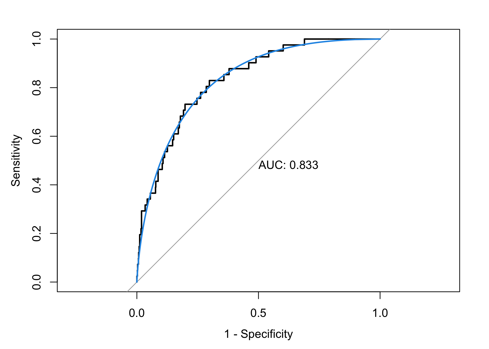

P8106 Midterm Project
================
Lin Yang

``` r
library(tidyverse)
library(caret)
library(glmnet)
library(mlbench)
library(pROC)
library(klaR)
library(vip)
library(AppliedPredictiveModeling)
```

## Data cleaning

``` r
stroke_dat <- read.csv("healthcare-dataset-stroke-data.csv") %>% 
  janitor::clean_names() %>% 
  dplyr::select(-1) %>% #delete the id column
  filter(bmi != "N/A") %>% #remove missing bmi values
  filter(gender != "Other") %>% 
  mutate(bmi = as.numeric(bmi),
         gender = factor(gender,
                         levels = c("Female", "Male"),
                         labels = c("0", "1")),
         ever_married = factor(ever_married,
                               levels = c("No", "Yes"),
                               labels = c("0", "1")),
         work_type = factor(work_type,
                            levels = c("children", "Govt_job", "Never_worked", "Private", "Self-employed"),
                            labels = c("0", "1", "2", "3", "4")),
         residence_type = factor(residence_type,
                                 levels = c("Rural", "Urban"),
                                 labels = c("0", "1")),
         smoking_status = factor(smoking_status,
                                 levels = c("formerly smoked", "never smoked", "smokes", "Unknown"),
                                 labels = c("0", "1", "2", "3")),
         stroke = factor(stroke,
                         levels = c("0", "1"),
                         labels = c("neg", "pos")))

#change all factor variables to numeric ones
stroke_dat <- stroke_dat %>% 
  mutate(gender = as.numeric(gender),
         hypertension = as.numeric(hypertension),
         heart_disease = as.numeric(heart_disease),
         ever_married = as.numeric(ever_married),
         work_type = as.numeric(work_type),
         residence_type = as.numeric(residence_type),
         smoking_status = as.numeric(smoking_status))


set.seed(2022)
trainRows <- createDataPartition(y = stroke_dat$stroke, p = 0.8, list = FALSE)
stroke_train <- stroke_dat[trainRows, ]
stroke_test <- stroke_dat[-trainRows, ]

x_train <- stroke_train[ , -11]
y_train <- stroke_train$stroke

x_test <- stroke_test[ , -11]
y_test <- stroke_test$stroke
```

## EDA

``` r
summary(stroke_dat)
```

    ##      gender          age         hypertension     heart_disease    
    ##  Min.   :1.00   Min.   : 0.08   Min.   :0.00000   Min.   :0.00000  
    ##  1st Qu.:1.00   1st Qu.:25.00   1st Qu.:0.00000   1st Qu.:0.00000  
    ##  Median :1.00   Median :44.00   Median :0.00000   Median :0.00000  
    ##  Mean   :1.41   Mean   :42.87   Mean   :0.09189   Mean   :0.04951  
    ##  3rd Qu.:2.00   3rd Qu.:60.00   3rd Qu.:0.00000   3rd Qu.:0.00000  
    ##  Max.   :2.00   Max.   :82.00   Max.   :1.00000   Max.   :1.00000  
    ##   ever_married     work_type     residence_type  avg_glucose_level
    ##  Min.   :1.000   Min.   :1.000   Min.   :1.000   Min.   : 55.12   
    ##  1st Qu.:1.000   1st Qu.:2.000   1st Qu.:1.000   1st Qu.: 77.07   
    ##  Median :2.000   Median :4.000   Median :2.000   Median : 91.68   
    ##  Mean   :1.653   Mean   :3.487   Mean   :1.507   Mean   :105.30   
    ##  3rd Qu.:2.000   3rd Qu.:4.000   3rd Qu.:2.000   3rd Qu.:113.50   
    ##  Max.   :2.000   Max.   :5.000   Max.   :2.000   Max.   :271.74   
    ##       bmi        smoking_status  stroke    
    ##  Min.   :10.30   Min.   :1.000   neg:4699  
    ##  1st Qu.:23.50   1st Qu.:2.000   pos: 209  
    ##  Median :28.10   Median :2.000             
    ##  Mean   :28.89   Mean   :2.584             
    ##  3rd Qu.:33.10   3rd Qu.:4.000             
    ##  Max.   :97.60   Max.   :4.000

``` r
stroke_dat_con <- stroke_dat %>% dplyr::select(age, avg_glucose_level, bmi)
theme1 <- transparentTheme(trans = .4)
trellis.par.set(theme1)

featurePlot(x = stroke_dat_con, 
            y = stroke_dat$stroke,
            scales = list(x = list(relation = "free"), 
                          y = list(relation = "free")),
            plot = "density", pch = "|", 
            auto.key = list(columns = 2))
```

<!-- -->

``` r
#LDA based on every combination of two variables
partimat(stroke ~ age + avg_glucose_level + bmi, 
         data = stroke_dat, method = "lda")
```

<!-- --><!-- -->

``` r
#correlation plot of predictors
corrplot::corrplot(cor(x_train), 
         method = "circle", 
         type = "full",
         tl.cex = 0.5)
```

<!-- -->

From the correlation plot, we can see that there are no highly
correlated predictors in general. `ever_marriedYes` is positively
correlated with `age`, which is reasonable.

## Fitting models

### Logistic regression

``` r
#glm
fit.glm <- glm(stroke ~ .,
               data = stroke_train,
               family = binomial(link = "logit"))

test.pred.prob <- predict(fit.glm,
                     newdata = stroke_test,
                     type = "response")
test.pred <- rep("neg", length(test.pred.prob))
test.pred[test.pred.prob > 0.5] <- "pos"

confusionMatrix(data = as.factor(test.pred),
                reference = stroke_test$stroke,
                positive = "pos")
```

    ## Confusion Matrix and Statistics
    ## 
    ##           Reference
    ## Prediction neg pos
    ##        neg 939  41
    ##        pos   0   0
    ##                                           
    ##                Accuracy : 0.9582          
    ##                  95% CI : (0.9437, 0.9698)
    ##     No Information Rate : 0.9582          
    ##     P-Value [Acc > NIR] : 0.5414          
    ##                                           
    ##                   Kappa : 0               
    ##                                           
    ##  Mcnemar's Test P-Value : 4.185e-10       
    ##                                           
    ##             Sensitivity : 0.00000         
    ##             Specificity : 1.00000         
    ##          Pos Pred Value :     NaN         
    ##          Neg Pred Value : 0.95816         
    ##              Prevalence : 0.04184         
    ##          Detection Rate : 0.00000         
    ##    Detection Prevalence : 0.00000         
    ##       Balanced Accuracy : 0.50000         
    ##                                           
    ##        'Positive' Class : pos             
    ## 

``` r
#ROC curve
roc.glm <- roc(stroke_test$stroke, test.pred.prob)
plot(roc.glm, legacy.axes = TRUE, print.auc = TRUE)
plot(smooth(roc.glm), col = 4, add = TRUE)
```

<!-- -->

``` r
#fit a logistic regression model using caret for CV
ctrl <- trainControl(method = "repeatedcv", repeats = 5,
                     summaryFunction = twoClassSummary,
                     classProbs = TRUE)
set.seed(2022)
model.glm <- train(x = stroke_train[ , 1:10],
                   y = stroke_train$stroke,
                   method = "glm",
                   metric = "ROC",
                   trControl = ctrl)
```

### Penalized logistic regression

``` r
#glmnGrid <- expand.grid(.alpha = seq(0, 1, length = 6),
#                        .lambda = exp(seq(-8, -2, length = 20)))
#set.seed(2022)
#model.glmn <- train(x = stroke_train[ , 1:10],
#                    y = stroke_train$stroke,
#                    method = "glmnet",
#                    tuneGrid = glmnGrid,
#                    metric = "ROC",
#                    trControl = ctrl)
#
#model.glmn$bestTune
#
#myCol<- rainbow(25)
#myPar <- list(superpose.symbol = list(col = myCol),
#              superpose.line = list(col = myCol))
#
#plot(model.glmn, par.settings = myPar, xTrans = function(x) log(x))
```

### GAM

``` r
#set.seed(2022)
#model.gam <- train(x = stroke_train[ , 1:10],
#                   y = stroke_train$stroke,
#                   method = "gam",
#                   metric = "ROC",
#                   trControl = ctrl)
#
#
#model.gam$finalModel
#
#plot(model.gam$finalModel, select = 3)
```

### MARS

``` r
set.seed(2022)
model.mars <- train(x = stroke_train[ , 1:10],
                    y = stroke_train$stroke,
                    method = "earth",
                    tuneGrid = expand.grid(degree = 1:4, 
                                           nprune = 2:15),
                    metric = "ROC",
                    trControl = ctrl)

plot(model.mars)
```

<!-- -->

``` r
coef(model.mars$finalModel) 
```

    ##                 (Intercept)                   h(age-64) 
    ##                 -5.46329629                 -0.05993882 
    ## h(avg_glucose_level-148.91)                hypertension 
    ##                  0.01129351                  0.71210190 
    ##                   h(age-81)                   h(age-76) 
    ##                 -0.97987117                  0.15848489 
    ##                   h(age-34) 
    ##                  0.09075657

``` r
vip(model.mars$finalModel)
```

<!-- -->

### LDA

``` r
fit.lda <- lda(stroke ~ ., data = stroke_train)
               
plot(fit.lda)
```

<!-- -->

``` r
fit.lda$scaling
```

    ##                            LD1
    ## gender            -0.051093933
    ## age                0.041883793
    ## hypertension       1.239555736
    ## heart_disease      0.747644290
    ## ever_married      -0.645166028
    ## work_type         -0.100903529
    ## residence_type     0.077124324
    ## avg_glucose_level  0.007054239
    ## bmi               -0.015333564
    ## smoking_status    -0.002221730

``` r
head(predict(fit.lda)$x)
```

    ##          LD1
    ## 1  2.1011340
    ## 3  0.2746292
    ## 4  2.7747484
    ## 9  2.2111065
    ## 10 1.2546174
    ## 11 0.1222576

``` r
lda.pred <- predict(fit.lda, newdata = stroke_test)
head(lda.pred$posterior)
```

    ##          neg        pos
    ## 2  0.8161806 0.18381944
    ## 5  0.8176120 0.18238797
    ## 6  0.5662772 0.43372285
    ## 7  0.8853007 0.11469928
    ## 8  0.9461471 0.05385291
    ## 14 0.8309128 0.16908724

``` r
summary(fit.lda)
```

    ##         Length Class  Mode     
    ## prior    2     -none- numeric  
    ## counts   2     -none- numeric  
    ## means   20     -none- numeric  
    ## scaling 10     -none- numeric  
    ## lev      2     -none- character
    ## svd      1     -none- numeric  
    ## N        1     -none- numeric  
    ## call     3     -none- call     
    ## terms    3     terms  call     
    ## xlevels  0     -none- list

``` r
#use caret
set.seed(2022)
model.lda <- train(x = stroke_dat[ , 1:10],
                   y = stroke_dat$stroke,
                   method = "lda",
                   metric = "ROC",
                   trControl = ctrl)
```
